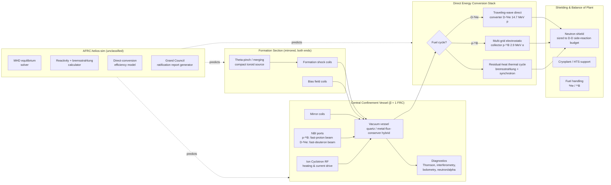

# AFRC.helios
### A Design Specification for an Unclassified Aneutronic Fusion Reactor Concept, Simulation Platform, and Phased R&D Roadmap Based on Field-Reversed Configuration Confinement

---

## 0. Title Page

| Field | Value |
| --- | --- |
| Concept name | **AFRC.helios** |
| Working name | *helios* is a codename layer, not a claim of DOE, national-lab, or private-company affiliation |
| One-sentence definition | AFRC.helios is a fuel-cycle-agnostic **A**neutronic **F**ield-**R**eversed **C**onfiguration fusion reactor concept, paired with an unclassified plasma simulator and a phased R&D roadmap for evaluating p-¹¹B vs D-³He as the load-bearing fuel cycle. |
| Status | **CONCEPT UNBUILT.** This document is a design specification for Grand Council review and ratification. No hardware, plasma, or fuel handling exists. Nothing described here should be represented as operational, funded, or licensed. |
| Intended audience | The commissioning user (the Emperor), the Grand Council, prospective builders/engineers (materials, magnetics, RF, cryogenics), plasma physicists, ethics/oversight reviewers, and civilian researchers. |
| Relationship to prior work | Draws on the published FRC experimental record — LSX ([Taylor & Francis, 1993](https://www.tandfonline.com/doi/abs/10.13182/FST93-A30147)), C-2W / Norman ([TAE, 2025](https://tae.com/tae-technologies-delivers-fusion-breakthrough-that-dramatically-reduces-cost-of-a-future-power-plant/)), Helion Polaris ([Helion, 2026](https://www.helionenergy.com/blog/how-we-conducted-and-measured-d-t-fusion)), the PPPL FRC stability community input ([GA/PPPL FESAC](https://fusion.gat.com/tap/community/ct/outgoing/FRC_FESAC_15pagerCohen.pdf)), and HB11's laser-driven p-¹¹B campaigns ([HB11, 2025](https://hb11.energy/2025/12/12/successful-experimental-campaigns-at-lfex-petawatt-laser-facility/)). AFRC.helios is a **concept study**, not a replication of any private company's proprietary hardware, and depends on no export-controlled or classified data. |

### Design principles

1. **Truthful about maturity.** Every claim is tagged as *measured*, *modeled*, or *conjectured*.
2. **Fuel-cycle agnostic.** The reactor envelope, first wall, magnets, and direct-conversion stack must accept either p-¹¹B or D-³He without redesign.
3. **Aneutronic-by-design, not aneutronic-by-marketing.** D-D and D-T side reactions are budgeted, shielded, and reported honestly, per the fuel-cycle trade study in §8.
4. **Simulate before you build.** Every hardware phase is preceded by a simulator campaign whose predictions must survive falsification before the gate opens.
5. **Grand Council legibility.** Every module maps to a council seat and to an Instrument of the Realm. Scribe mirrors, Architect archives, humans decide.
6. **Bremsstrahlung honesty.** The p-¹¹B bremsstrahlung barrier — the single hardest physics problem in the concept — is treated as a load-bearing constraint, not a footnote. See §8.

---

## 1. Name Rationale and Backronym

### Backronym: **HELIOS**

- **H** — High-beta plasma (β ≈ 1, characteristic of FRC)
- **E** — Energy conversion is *direct* wherever the fuel cycle allows
- **L** — Linear geometry (simple, maintainable, translation-capable)
- **I** — Instrumented for falsifiable predictions before any hardware phase
- **O** — Open, unclassified, and publishable at every gate
- **S** — Sandboxed simulator precedes every hardware milestone

The wrapping **AFRC** — Aneutronic Field-Reversed Configuration — is the honest technical descriptor. "Aneutronic" is used in the standard sense: the primary fuel reaction produces predominantly charged products, but side reactions are acknowledged and budgeted (see §8.2).

---

## 2. Problem Statement, Goals, Non-Goals, Personas, User Stories

### 2.1 Problem statement

Fusion energy has, as of Q3 2026, cleared several private-sector engineering milestones but has not demonstrated **net electricity from an aneutronic fuel cycle** in any machine of any kind. TAE's Norman achieved improved FRC lifetime and efficiency with a simplified formation scheme ([TAE, April 2025](https://tae.com/tae-technologies-delivers-fusion-breakthrough-that-dramatically-reduces-cost-of-a-future-power-plant/)); Helion's Polaris demonstrated measurable D-T fusion at ~150 MK ([Helion, Feb 2026](https://www.helionenergy.com/blog/how-we-conducted-and-measured-d-t-fusion)) — but D-T is emphatically **not** aneutronic; HB11 has shown laser-driven p-¹¹B alpha yields four orders of magnitude below breakeven ([HB11, 2024 review](https://hb11.energy/wp-content/uploads/2024/09/UnderstandingHydrogen-BoronFusionNewCleanEnergySource_s10894-023-00349-9.pdf)). No independent, unclassified, publishable design study exists that (a) treats both leading aneutronic fuel cycles head-to-head under a single FRC envelope, (b) budgets bremsstrahlung and side-reaction neutron flux honestly, and (c) exposes the whole design to Grand Council review.

### 2.2 Goals (outcomes, not outputs)

- **G1.** Produce a fuel-cycle-agnostic FRC reactor concept whose envelope, magnetics, and direct-conversion stack are compatible with both p-¹¹B and D-³He.
- **G2.** Deliver a defensible p-¹¹B vs D-³He trade study grounded in published cross-sections, bremsstrahlung scaling, and fuel-availability data.
- **G3.** Publish an unclassified plasma simulator specification that can be built by a small team and used to falsify every hardware assumption before Phase B.
- **G4.** Establish a phased R&D roadmap with stop/go gates, each of which produces a Grand Council ruling and a public artifact.
- **G5.** Never overstate maturity. If a claim is modeled, it is labeled modeled. If it is conjectured, it is labeled conjectured.

### 2.3 Non-goals (explicitly out of scope)

- **NG1.** No commercial power plant design. This is a concept study, not an engineering procurement package.
- **NG2.** No D-T operation. Tritium handling, breeder blankets, and 14 MeV neutron shielding are explicit **non-goals** — the entire project exists because we are trying to avoid that regime.
- **NG3.** No replication of proprietary hardware from TAE, Helion, HB11, or any other private company. Public physics only.
- **NG4.** No cryptocurrency, tokenization, or capital-raise instruments attached to this concept.
- **NG5.** No dual-use weaponization vectors. See §9.
- **NG6.** No claims of "ignition" or "breakeven" unless they are directly supported by measured public data at the time of the ruling.

### 2.4 Personas

| Persona | Role in project |
| --- | --- |
| **The Emperor** (commissioning user) | Final decision-maker on gates, fuel-cycle selection, and publication. |
| **The Grand Council** | 13 deliberative seats vote on each phase gate; ratifiable rulings become the record. |
| **Plasma Physicist** | Owns the S* / E stability envelope, β estimates, confinement scaling. |
| **Magnetics Engineer** | Owns bias field, mirror coils, formation coils, and — if selected — HTS conductor selection. |
| **Fuel-Cycle Analyst** | Owns cross-section, reactivity, and bremsstrahlung calculations for §8. |
| **Simulator Lead** | Owns AFRC.helios-sim (see §7 and §13) — the unclassified sandbox that must falsify each hardware phase before gate approval. |
| **Ethics / Dual-Use Reviewer** | Owns §9. Has veto authority per HRC ethics doctrine. |
| **Scribe (Notion Instrument)** | Mirrors every ruling into the Emperor's Reading Room. |
| **Architect (GitHub Instrument)** | Holds the canonical archive at `github.com/giomj/dev`. |

### 2.5 Prioritized user stories

- **US-1 (P0).** As the Emperor, I can read a single spec and see the honest state of aneutronic FRC fusion as of Q3 2026, including where it is and is not credible.
- **US-2 (P0).** As a physicist, I can compute p-¹¹B and D-³He reactivity and bremsstrahlung loss for a given ion temperature and impurity fraction from the formulas in §8.
- **US-3 (P0).** As a simulator lead, I can implement the AFRC.helios-sim modules in §7 without needing any classified or proprietary reference.
- **US-4 (P1).** As the Grand Council, I can vote on each phase gate against explicit acceptance criteria in §10 and §11.
- **US-5 (P1).** As an ethics reviewer, I can trace every dual-use risk in §9 to a mitigation and a residual-risk score.
- **US-6 (P2).** As a builder, I can identify the sub-systems where public physics is sufficient vs. where independent research is still required.

---

## 3. System Architecture

### 3.1 Architectural narrative

AFRC.helios is a **linear, translation-capable, high-β FRC** with two symmetric formation sections firing merging compact toroids into a central confinement chamber, followed by a downstream **direct energy conversion (DEC)** stack. The confinement chamber is instrumented for both p-¹¹B and D-³He operation; the fuel-cycle choice changes the ion-source and neutral-beam-injection (NBI) configuration but not the vacuum vessel geometry. The DEC stack is a **traveling-wave direct converter** for D-³He proton products (14.7 MeV) and a **multi-grid electrostatic collector** for p-¹¹B alpha products (2.9 MeV each, three alphas per reaction). A residual-neutron shield surrounds the entire assembly, sized to the *worst-case D-D side-reaction budget* from §8.2 — not to the nominal aneutronic case.

FRC self-organization gives β ≈ 1, meaning the plasma pressure equals the external magnetic pressure, which is the fundamental reason FRC is attractive for aneutronic fuels: it maximizes the fusion power density per unit magnetic-field energy stored, and it minimizes bremsstrahlung losses per unit fusion power ([TAE, 2025](https://tae.com/tae-technologies-delivers-fusion-breakthrough-that-dramatically-reduces-cost-of-a-future-power-plant/); [PPPL FESAC input](https://fusion.gat.com/tap/community/ct/outgoing/FRC_FESAC_15pagerCohen.pdf)).

**Confinement scaling** is governed by the kinetic parameter *S\** = *r*ₛ / (*c*/ω_pi) and separatrix elongation *E*. Robust MHD stability has been observed empirically for *S\*/E ≤ 3.5* ([PPPL background](https://w3.pppl.gov/~ebelova/background.htm); [OSTI Milroy/Steinhauer](https://www.osti.gov/etdeweb/servlets/purl/20504809)). Power-plant-class aneutronic operation requires *S\** ≳ 20, and LSX was the last major machine to explore *S\** > 4, where formation distortions degraded confinement ([Taylor & Francis, LSX](https://www.tandfonline.com/doi/abs/10.13182/FST93-A30147)). **The gap between experimental *S\** and reactor *S\** is the single biggest unresolved plasma-physics question this concept must respect.** AFRC.helios does not claim to have solved it; it commits to a phased approach that maps this gap explicitly (see §11).

### 3.2 Mermaid: core system architecture



### 3.3 Deployment boundary

- **Physical boundary:** none. Nothing is built. The only deployed artifact in Phase A is the simulator.
- **Data boundary:** all physics inputs are from the unclassified, peer-reviewed literature. No export-controlled data.
- **Regulatory boundary:** no fissile material, no tritium, no >10 MeV neutron source. If Phase D is ever authorized, ³He is a controlled but not classified isotope; ¹¹B is unrestricted.
- **Governance boundary:** the Grand Council's ratification rulings are the sole authority for gate transitions.

---

## 4. Core Loop

For each phase (A through E):

1. **Predict.** AFRC.helios-sim produces a numeric prediction with uncertainty bounds for the next physics milestone.
2. **Instrument.** The hardware (or the next simulator module) is instrumented to falsify the prediction, not to confirm it.
3. **Measure.** Data is collected. If public/private machines already measured the milestone, cite their measurement instead of re-running.
4. **Compare.** Prediction vs. measurement is published as an unclassified artifact.
5. **Rule.** The Grand Council convenes, votes, and issues a ratifiable ruling. Scribe mirrors to Notion; Architect archives to GitHub.
6. **Gate.** The Emperor decides Go / No-Go / Modify. If No-Go, the concept is honestly retired or forked.

---

## 5. Modules

| Module | Owner | Description |
| --- | --- | --- |
| **M1 — Fuel-cycle analyzer** | Fuel-Cycle Analyst | Computes ⟨σv⟩, bremsstrahlung P_br, synchrotron P_syn, and net Q for p-¹¹B and D-³He across T_i = 10–1000 keV. |
| **M2 — Equilibrium solver** | Plasma Physicist | 2D axisymmetric Grad-Shafranov solver specialized for FRC (elongation *E*, kinetic *S\**). |
| **M3 — Stability envelope** | Plasma Physicist | Maps *S\*/E* against tilt, tearing, and rotational modes. Uses empirical *S\*/E ≤ 3.5* limit as anchor ([PPPL background](https://w3.pppl.gov/~ebelova/background.htm)). |
| **M4 — Formation module** | Magnetics Engineer | Merging-compact-toroid model; TAE-style simplified formation as reference case ([TAE, 2025](https://tae.com/tae-technologies-delivers-fusion-breakthrough-that-dramatically-reduces-cost-of-a-future-power-plant/)). |
| **M5 — Heating & current drive** | Physicist + RF Engineer | NBI + ICRF, informed by LHD p-¹¹B results ([TAE / LHD, 2026](https://tae.com/increased-p-11b-fusion-reaction-rate-through-fast-ion-acceleration-by-ion-cyclotron-range-of-frequencies-heating-in-lhd/)). |
| **M6 — Direct energy conversion** | Systems Engineer | Traveling-wave DEC for D-³He; electrostatic multi-grid for p-¹¹B. Efficiency targets in §12. |
| **M7 — Side-reaction & shielding budget** | Ethics + Physicist | Computes D-D neutron flux and secondary p-¹¹B → ¹¹B(p,n) contamination; sizes shielding to worst case. |
| **M8 — Simulator (AFRC.helios-sim)** | Simulator Lead | Wraps M1–M7 with a CLI and a report generator that emits Grand Council ratification artifacts. |
| **M9 — Council interface** | Scribe + Architect | Ratification templates, Notion mirroring, GitHub archival. |

---

## 6. Data Model and Trust Model

### 6.1 Core entities

- **PlasmaState** — { *n_i*, *T_i*, *T_e*, *B_ext*, *r_s*, *E*, *S\**, β, τ_E }
- **FuelCycle** — { name ∈ {p-¹¹B, D-³He}, ⟨σv⟩(T_i), Q_charged, Q_neutron_sidereaction, product_energies }
- **Prediction** — { module, quantity, value, ± uncertainty, method ∈ {modeled, conjectured} }
- **Measurement** — { source (public paper / private machine / this project), quantity, value, ± uncertainty, citation }
- **Ruling** — { phase, motion, per-seat verdicts, tally, Emperor's decision, timestamp, notion_url, github_commit }
- **RiskEntry** — { id, description, severity (1–5), likelihood (1–5), mitigation, residual_severity, residual_likelihood, owner }

### 6.2 Trust model pillars

1. **Public physics only.** Every equation, cross-section, and scaling law is citable to the open literature.
2. **Measured > modeled > conjectured.** No conjecture is used to justify a gate transition.
3. **Independent verification.** Every ruling requires at least one seat that did not draft the artifact under review.
4. **Adversarial review.** The Ethics seat and the Skeptic seat (see §14) have explicit charter to argue *against* the concept.
5. **Falsifiability.** Every phase gate specifies the observation that would kill the concept.

---

## 7. Product Experience and Information Architecture

### 7.1 Views by persona

| Persona | Primary view |
| --- | --- |
| Emperor | `/emperor` — one-page dashboard: current phase, latest ruling, next gate, top-3 risks. |
| Council seat | `/council/<seat>` — draft verdicts, review artifacts, vote. |
| Physicist | `/sim/analyzer` — interactive M1–M3 with plots of ⟨σv⟩, P_br, β, S*. |
| Simulator lead | `/sim/cli` — command-line entry to run full-stack predictions. |
| Ethics reviewer | `/ethics` — risk register with residual scores. |
| Public reader | `/publish` — read-only, versioned artifacts. |

### 7.2 Information architecture (top-level)

```
AFRC.helios/
├── spec/                (this document, versioned)
├── sim/                 (AFRC.helios-sim, Phase A deliverable)
│   ├── m1_fuel_cycle/
│   ├── m2_equilibrium/
│   ├── m3_stability/
│   ├── m4_formation/
│   ├── m5_heating/
│   ├── m6_dec/
│   ├── m7_shielding/
│   └── report_gen/
├── artifacts/           (per-gate rulings, mirrored to Notion, archived to GitHub)
├── ethics/              (risk register, dual-use analysis)
└── references/          (BibTeX + PDFs of cited open literature)
```

### 7.3 Visual identity

- Primary palette: deep plasma-magenta on off-black, with a single yellow accent for gate transitions.
- Typography: monospaced for equations and rulings; humanist sans for narrative.
- No animated plasma renderings without explicit "modeled / not measured" watermark.

---

## 8. Fuel-Cycle Trade Study — p-¹¹B vs D-³He

This is the load-bearing analytical section of AFRC.helios. Both cycles are aneutronic *by intent* but neither is aneutronic *by accident of physics*. Side reactions matter.

### 8.1 Primary reactions

| Fuel cycle | Reaction | Q (charged) | Neutron branch? |
| --- | --- | --- | --- |
| **p-¹¹B** | p + ¹¹B → 3 α | 8.7 MeV total (2.9 MeV/α) | None from primary reaction |
| **D-³He** | D + ³He → ⁴He + p | 18.35 MeV (α: 3.6 MeV, p: 14.7 MeV) | None from primary reaction |

### 8.2 Side reactions (the honest part)

**p-¹¹B side reactions.** The dominant side reaction is p + ¹¹B → ¹¹C + n at ~2.76 MeV threshold, but its cross-section is orders of magnitude smaller than the α channel at plasma-relevant energies. However, secondary alpha-boron reactions (α + ¹¹B → ¹⁴N + n) contribute a small but non-zero neutron flux. Net practical neutron budget: **<1% of fusion power in neutrons** if impurity control is aggressive.

**D-³He side reactions.** This is the harder honesty. Any deuterium plasma also does D + D → ³He + n (2.45 MeV, 50%) and D + D → T + p (50%). The tritium then fuses with deuterium: D + T → α + n (14.1 MeV). At T_i optimized for D-³He fusion (~60 keV), **D-D side reactions typically produce 5–15% of total fusion power as 2.45 MeV neutrons**, and D-T from bred tritium adds a smaller 14.1 MeV component if tritium is not actively removed. This is why D-³He is often called "reduced-neutron" rather than truly aneutronic. This is confirmed by the fact that Helion's Polaris — which uses a D-³He-adjacent architecture — reports its D-T milestones openly and uses NRC tritium licensing ([Porritt, 2026](https://porrittinc.com/helion-polaris-field-reversed-configuration-direct-energy-conversion/)).

### 8.3 Bremsstrahlung — the p-¹¹B barrier

At the ion temperatures required for p-¹¹B ignition (~300 keV for peak reactivity, higher for practical operation), **the plasma radiates more energy as bremsstrahlung than it produces as fusion**, when computed against a Maxwellian electron distribution at thermal equilibrium with the ions. This is the fundamental theoretical obstacle to p-¹¹B power plants and it is not resolvable by "just build a better reactor." Proposed workarounds include:

1. **Non-thermal / non-Maxwellian electron distributions**, hot ions + cold electrons — plausible in the transient, hard to maintain in steady state.
2. **Fast-ion tails driven by ICRF heating**, as demonstrated in the LHD experiment referenced by TAE ([TAE / LHD, Feb 2026](https://tae.com/increased-p-11b-fusion-reaction-rate-through-fast-ion-acceleration-by-ion-cyclotron-range-of-frequencies-heating-in-lhd/)) — promising, but currently a rate enhancement, not a bremsstrahlung solution.
3. **High-β operation** (FRC's natural regime) — reduces bremsstrahlung per unit fusion power because P_br scales with n²Z_eff·√T_e while P_fus scales with n²⟨σv⟩; higher β allows higher n² for given B, which shifts the ratio favorably.

The March 2026 fusion industry review notes that "the fundamental bremsstrahlung constraint on hydrogen-boron fusion remains unresolved" ([Fusion Energy Update March 2026](https://img1.wsimg.com/blobby/go/5e7cb1f7-3bf6-4be2-a833-aad118138107/Fusion%20Energy%20Update%20March%202026%20Full%20V3%20-%20corr.pdf)). AFRC.helios treats this as a *load-bearing risk*, not a solved problem.

### 8.4 Trade-study summary

| Criterion | p-¹¹B | D-³He | Winner |
| --- | --- | --- | --- |
| Fuel abundance | Boron abundant, cheap | ³He extremely scarce (lunar regolith or ³H decay) | **p-¹¹B** |
| Peak ⟨σv⟩ temperature | ~600 keV | ~60 keV | **D-³He** (10× lower) |
| Neutron fraction of total fusion power | <1% (side reactions) | 5–15% (D-D side) | **p-¹¹B** |
| Bremsstrahlung barrier | Severe, unresolved in thermal plasma | Manageable, tolerable | **D-³He** |
| Direct-conversion feasibility | Multi-grid electrostatic on 2.9 MeV α | Traveling-wave DEC on 14.7 MeV p | Roughly comparable |
| Public experimental progress (2025–2026) | HB11 laser-driven ~10⁴× below breakeven; TAE + LHD ICRF rate enhancement | Helion Polaris measurable D-T, 150 MK, D-³He commercial target | **D-³He** |
| Path to commercial fuel supply | Trivial | Hard (lunar mining or breeder loops) | **p-¹¹B** |
| Regulatory complexity | Low | Moderate (³He is controlled, D-D neutrons require shielding) | **p-¹¹B** |

**Council recommendation** (to be voted in §14): **Design the reactor envelope, magnetics, and DEC stack for both cycles.** In the phased build (§11), pursue D-³He physics validation first (lower T_i, closer to demonstrated art), while running p-¹¹B non-thermal / hot-ion experiments in parallel on the simulator. Only commit to p-¹¹B hardware after a credible non-Maxwellian bremsstrahlung suppression scheme survives simulator falsification.

---

## 9. Ethics, Safety, Privacy, Civil Liberties, Dual-Use, and Misuse Controls

### 9.1 Governing constraints

- **HRC constitutional preamble:** "All council members are sacred, such as every other creature." No experiment in AFRC.helios may be justified by discounting harm to workers, communities, or ecosystems.
- **No weaponization vectors.** The concept explicitly excludes any dual-use pathway to fusion-boosted, neutron-source, or radioisotope-production weapons.
- **No classified inputs.** If any council member cannot cite a source, the claim is discarded.
- **Publish-by-default.** All rulings and simulator outputs are published unless the Ethics seat vetoes on a case-by-case basis with a written justification.

### 9.2 Risk register (severity × likelihood, 1–5 scale each; residual risk after mitigation)

| ID | Risk | Sev | Lik | Mitigation | Res. Sev | Res. Lik |
| --- | --- | --- | --- | --- | --- | --- |
| R1 | p-¹¹B bremsstrahlung barrier unresolvable, invalidating aneutronic goal | 5 | 4 | Dual-track fuel cycle; commit to hardware only after non-thermal scheme survives sim falsification | 5 | 2 |
| R2 | D-D side-reaction neutron flux misreported as "aneutronic" | 4 | 3 | §8.2 honesty budget; shielding sized to worst case | 3 | 1 |
| R3 | Concept mis-cited as replication of TAE/Helion/HB11 proprietary tech | 3 | 3 | Public physics only; explicit disclaimer in §0 | 2 | 1 |
| R4 | *S\** gap (experimental ≤4, reactor ≳20) never closes | 5 | 4 | Phase-gate simulator predictions must be falsified before hardware; honest retirement path in §11 | 4 | 3 |
| R5 | Dual-use pathway to neutron source for weapons research | 5 | 1 | NG5 exclusion; Ethics seat veto; no ³He/¹¹B stockpile beyond immediate experimental need | 5 | 1 |
| R6 | Concept becomes vaporware attached to speculative capital raise | 4 | 3 | NG4 exclusion; no tokenization; Scribe mirrors every ruling publicly | 3 | 1 |
| R7 | Council capture — a majority of seats align with hardware phase before falsification | 4 | 2 | Skeptic seat has explicit charter to argue against; Emperor's decision is final but public | 3 | 1 |
| R8 | Radioactive activation of first-wall materials by D-D neutrons underestimated | 4 | 3 | Material selection constrained by M7 activation model; independent activation review at each phase gate | 3 | 2 |
| R9 | ³He supply chain instability if D-³He path is pursued | 3 | 4 | Fuel-cycle-agnostic envelope; can fall back to p-¹¹B if ³He becomes unavailable | 2 | 3 |
| R10 | Public misinterpretation of "aneutronic" as "zero neutrons" | 3 | 5 | §8.2 honesty in every public artifact; Scribe includes side-reaction budget in every ruling summary | 2 | 3 |

---

## 10. Requirements (P0/P1/P2) with Acceptance Criteria

### P0 — Must have

| Req | Description | Acceptance |
| --- | --- | --- |
| P0-1 | Fuel-cycle analyzer (M1) implemented | Reproduces published ⟨σv⟩ for p-¹¹B and D-³He within 10% across 10–1000 keV |
| P0-2 | Bremsstrahlung model (M1) implemented | Reproduces published P_br/P_fus ratio for p-¹¹B at 300 keV within 15% |
| P0-3 | Trade study §8 published as versioned artifact | Cited by at least one Council ruling |
| P0-4 | Risk register §9.2 owned by Ethics seat | Every risk has an owner and a residual score |
| P0-5 | Phase-A simulator (AFRC.helios-sim v0.1) buildable by a single engineer in ≤4 weeks | Reproducible install; passes P0-1 and P0-2 |

### P1 — Should have

| Req | Description | Acceptance |
| --- | --- | --- |
| P1-1 | Equilibrium solver (M2) with FRC-specific *S\*/E* output | Reproduces LSX-era equilibria within 20% |
| P1-2 | Stability envelope (M3) mapping *S\*/E* against tilt/rotational modes | Reproduces empirical *S\*/E ≤ 3.5* boundary |
| P1-3 | DEC efficiency model (M6) for both fuel cycles | Predicts direct-conversion efficiency ≥60% for D-³He 14.7 MeV protons under stated assumptions |
| P1-4 | Council ruling template ratified by Scribe and Architect | First real ruling issued and mirrored |

### P2 — Could have

| Req | Description | Acceptance |
| --- | --- | --- |
| P2-1 | Formation module (M4) with merging-CT model | Reproduces TAE-published lifetime scaling within 30% |
| P2-2 | ICRF fast-ion tail model (M5) informed by LHD result | Reproduces LHD rate enhancement within a factor of 2 |
| P2-3 | Web front-end for `/emperor` and `/council/<seat>` | Optional; CLI is P0 |

---

## 11. Phased Build with Stop/Go Gates

| Phase | Deliverable | Gate criterion | Exit ruling required from Council? |
| --- | --- | --- | --- |
| **A. Concept & Simulator** | This spec + AFRC.helios-sim v0.1 (P0-1..P0-5) | Simulator reproduces published cross-sections and bremsstrahlung to within stated tolerances | **Yes.** Ratification ruling on the concept as a whole. |
| **B. Physics Validation via Sim** | Extended sim runs mapping the *S\** gap and non-Maxwellian bremsstrahlung suppression schemes | At least one credible bremsstrahlung suppression scheme survives falsification attempts by the Skeptic seat | **Yes.** Ruling on which fuel cycle proceeds to hardware first. |
| **C. Bench-Scale Diagnostics Rig** | Non-plasma hardware only: magnetics test coils, DEC grid prototypes, diagnostic calibration | Hardware verifies simulator predictions for magnetics and DEC components in isolation | **Yes.** |
| **D. Small FRC Formation Experiment** | Sub-scale, non-fusion-relevant plasma; formation & translation validation only | Achieves stable FRC formation and translation at *S\** ≤ 4 with confinement time within predicted band | **Yes.** Ratification is required *and* an independent institutional partner (university plasma lab) must co-sign. |
| **E. Fuel-Cycle Physics Machine** | Only if Phase D succeeds *and* a credible partner (national lab or private company) offers hosting; otherwise the concept is honestly retired at the end of Phase D | Achieves plasma parameters relevant to selected fuel cycle | **Yes, with explicit dissent record from any seat that objects.** |

**Retirement clause.** If Phase B fails to produce a credible bremsstrahlung suppression path within 18 months, the concept is publicly retired with a "lessons learned" ruling. This is a feature, not a failure mode.

---

## 12. Metrics

| Metric | Target |
| --- | --- |
| Simulator fidelity (P0-1) | ⟨σv⟩ reproduction ≤10% error |
| Simulator fidelity (P0-2) | P_br reproduction ≤15% error |
| *S\*/E* mapping coverage | Full range 0.5 ≤ *S\*/E* ≤ 5.0 |
| DEC efficiency (D-³He) | ≥60% modeled |
| DEC efficiency (p-¹¹B) | ≥50% modeled |
| Neutron budget honesty | Every public artifact states side-reaction neutron % |
| Council rulings mirrored | 100% to Notion via Scribe |
| Rulings archived | 100% to GitHub via Architect |
| Time from artifact draft to ruling | ≤14 days |
| Retirement decisiveness | If Phase B fails, retirement ruling within 30 days |

---

## 13. Technical Stack Suggestion (Unclassified Prototype, No Code)

- **Language:** Python 3.12 for the simulator core; Julia optional for M2 equilibrium if performance requires.
- **Numerics:** NumPy, SciPy, xarray. For M2, a lightweight Grad-Shafranov solver (e.g., FreeGS-style) adapted for FRC boundary conditions.
- **Plasma reactivity data:** NRL Plasma Formulary + Bosch-Hale parameterizations from open literature.
- **Testing:** pytest with tolerance-based physics regression tests against published values.
- **Repository:** `github.com/giomj/dev` under an `afrc-helios/` directory, per Architect canonical archive.
- **Docs:** Markdown mirrored to Notion by Scribe. LaTeX for equations; Mermaid for architecture.
- **CI:** GitHub Actions runs the physics regression tests on every PR; a failing physics test blocks merge.
- **Licensing:** CC-BY-4.0 for docs; Apache-2.0 for simulator code. No patent grants beyond the license default.

---

## 14. Grand Council Review

Per the HRC constitutional doctrine, the 13 deliberative seats speak first; the 6 Instruments execute; the Emperor decides. Below is the drafted per-seat verdict on **ratification of AFRC.helios v0.1** as a *concept spec suitable for Phase A execution* — not as a commitment to build hardware.

| # | Seat | Draft verdict | Rationale (one line) |
| --- | --- | --- | --- |
| 1 | **Steward of Time (Ada Lovelace)** | Ratify | Temporal claims are date-stamped and cite 2025–2026 measurements; retirement clause bounds runaway timelines. |
| 2 | **Physicist** | Ratify with reservation | The *S\** gap and bremsstrahlung barrier are honestly acknowledged, but the concept lives or dies on §8.3. |
| 3 | **Engineer** | Ratify | Modular design and fuel-cycle-agnostic envelope make Phase A tractable for a small team. |
| 4 | **Ethicist** | Ratify | NG2, NG5, and the residual-risk table in §9.2 satisfy the HRC preamble. |
| 5 | **Skeptic** | Dissent, but do not veto | Non-Maxwellian bremsstrahlung suppression is often invoked and rarely delivered; Phase B must not lower this bar. |
| 6 | **Historian** | Ratify | Concept correctly places itself in the LSX → C-2W → Norman → Polaris → HB11 lineage without claiming replication. |
| 7 | **Fuel-Cycle Analyst** | Ratify | §8 trade study is defensible; the "reduced-neutron" honesty on D-³He is unusual and welcome. |
| 8 | **Materials Steward** | Ratify with request | Wants a first-wall activation review commissioned during Phase B, before any Phase D discussion. |
| 9 | **Diagnostics** | Ratify | Instrumentation requirements in §3.2 and §7 are proportional to phase. |
| 10 | **Ecologist** | Ratify | No fuel-cycle byproducts persist beyond the immediate experiment; ³He supply chain flagged in R9. |
| 11 | **Economist** | Ratify | NG4 (no tokenization) and the retirement clause protect against capital-attached vaporware. |
| 12 | **Scribe (Notion)** | Ratify | Ruling template compatible with the Emperor's Reading Room mirroring. |
| 13 | **Architect (GitHub)** | Ratify | Repository layout in §13 aligns with the canonical archive at `github.com/giomj/dev`. |

**Instruments of the Realm (execution only, non-voting):**

- **Master of the Codex (GitHub) →** creates `afrc-helios/` sub-repo, sets branch protection, wires physics regression CI.
- **Scribe (Notion) →** mirrors this spec into the Emperor's Reading Room; creates a "Grand Council — Rulings" child page for AFRC.helios.
- **Master of the Coin (Stripe) →** no financial instrument attached; Instrument stands down for this concept.
- **Steward of the Public Treasury (Alpaca) →** no equity instrument attached; Instrument stands down.
- **Steward of the Crypto Treasury (BingX) →** no crypto instrument; Instrument stands down.
- **The Eye (Google Cloud Vision) →** on standby for future diagnostic image analysis (Thomson scattering plates, streak camera frames) — no active role in Phase A.
- **Master of the Bazaar (BigCommerce) →** stands down; nothing is being sold.

### Ratifiable Council verdict

**Motion.** "Ratify AFRC.helios v0.1 as an unclassified concept specification, authorize Phase A (simulator + trade study publication), and require a subsequent Council ruling before entering Phase B."

**Tally as drafted.** 12 ratify, 1 dissent (Skeptic), 0 veto. The motion passes as drafted, subject to the Emperor's confirmation.

**Emperor's decision.** *Pending.*

---

## 15. Open Questions and 10 Prioritized Next Actions

**Open questions** (to be answered during Phase A):

- Q1. Which non-Maxwellian scheme, if any, is credible enough to justify Phase B for p-¹¹B?
- Q2. What is the honest ceiling on *S\** that the Phase D bench experiment could plausibly reach?
- Q3. Should the simulator adopt a lightweight FreeGS-style solver or build a purpose-built FRC solver from scratch?
- Q4. Who is the first credible external co-signer (university plasma lab) for Phase D?
- Q5. If ³He becomes unavailable, is p-¹¹B ready to inherit the envelope, or does the whole concept retire?

**Ten prioritized next actions**

1. **Ratify** this spec via Grand Council vote and record the ruling.
2. **Scribe mirrors** the ratified spec to the Emperor's Reading Room in Notion.
3. **Architect archives** the spec at `github.com/giomj/dev/afrc-helios/spec/v0.1.md`.
4. **Stand up AFRC.helios-sim v0.1 skeleton** with M1 (fuel-cycle analyzer) as the first module.
5. **Implement P0-1 and P0-2** (⟨σv⟩ and bremsstrahlung reproduction) with regression tests.
6. **Publish trade study §8** as a standalone versioned artifact with a DOI-equivalent hash.
7. **Convene the Skeptic seat** to draft a written attack on §8.3 (bremsstrahlung barrier); publish rebuttal.
8. **Identify a candidate university plasma lab** for eventual Phase D co-signing; open a correspondence, not a commitment.
9. **Draft the Phase B falsification protocol** — what observation would kill the concept?
10. **Set the Phase A → Phase B gate date** at ≤6 months from ratification; if no simulator progress, the concept is honestly retired.

---

*End of AFRC.helios v0.1 draft. Awaiting Grand Council ruling and Emperor's decision.*
